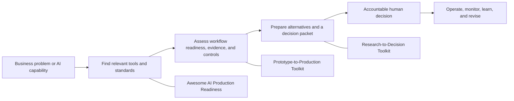

# Anonymousyz

## Applied AI deployment and governance portfolio

This profile contains practical methods and local tools for a specific operational question:

> An AI prototype works in a demonstration. What evidence, controls, and decision rights are required before it is allowed to affect a real workflow?

The work is aimed at the point where product design, engineering, risk, compliance, and operating ownership meet. In a real organization, model quality is only one input to that conversation. The decision also depends on the workflow being changed, authorized data, evaluation evidence, human override design, auditability, cost, incident ownership, and rollback.

The repositories use a pseudonymous public handle. They publish methods, fictional cases, public sources, schemas, and executable local tools while deliberately excluding client, employer, personal, and confidential operational material.

## Portfolio architecture

| Operating question | Public repository | Primary deliverables | Typical reviewer |
|---|---|---|---|
| Is an AI prototype structurally prepared for a bounded pilot or production decision? | [AI Prototype-to-Production Toolkit](https://github.com/Anonymousyz/ai-prototype-to-production-toolkit) | Fixed 70-point local CLI, eight veto conditions, JSON schema, readiness checklist, system card, risk register, evaluation plan, pilot memo, and fictional cases | Product owner, FDE, solutions architect, security or risk lead |
| Which tools and standards can close a known gap in evaluation, observability, guardrails, governance, or deployment? | [Awesome AI Production Readiness](https://github.com/Anonymousyz/awesome-ai-production-readiness) | Curated 57-resource catalog, curation rules, archived-resource handling, duplicate detection, and link verification | Architect, AI platform lead, governance practitioner, technical researcher |
| How should readiness and research evidence become a decision packet for accountable humans? | [Research-to-Decision Toolkit](https://github.com/Anonymousyz/research-to-decision-toolkit) | Fixed 24-point structural check, decision-review module, evidence matrix, alternatives, pre-mortem, CLI, and fictional decision packet | Consultant, policy analyst, product leader, governance or investment committee member |

## Operating method

The portfolio follows a repeatable sequence rather than a generic AI checklist.

1. **Bound the workflow.** Name the user, decision point, input sources, prohibited data, downstream action, operating owner, and rollback condition.
2. **Create evidence.** Define evaluation cases, acceptance criteria, known failure modes, residual gaps, and the evidence that could change the conclusion.
3. **Design controls.** Specify human review, access rights, logging, escalation, monitoring, cost ownership, and incident response.
4. **Separate review from approval.** A score or validation result can make omissions visible. It cannot authenticate evidence, prove a reviewer is independent, or approve a deployment.
5. **Keep a usable artifact.** The output should survive the original conversation: a decision memo, risk register, system card, evaluation plan, operating handover, or versioned tool.

This sequence is useful in regulated and high-consequence settings, but it is intentionally portable. The tools do not assert legal applicability or replace sector-specific review.

## What a reviewer can inspect

The public repositories provide more than a framework description:

- executable Python CLIs with no model API-key dependency;
- fixed schemas and explicit input contracts;
- unit tests for invalid input, veto conditions, missing evidence, reviewer metadata, and report generation;
- generated Markdown reports from fictional cases;
- NIST AI RMF and OWASP mappings with explicit scope limits;
- complete licenses, changelogs, release notes, security boundaries, and reproducible commands;
- a machine-readable resource catalog with duplicate checks and a release-time link report.

For a detailed file-by-file review path, start with the flagship repository's [portfolio evidence map](https://github.com/Anonymousyz/ai-prototype-to-production-toolkit/blob/main/docs/portfolio_evidence_map.md).

## Releases and verification

| Repository | Current public release | What the release makes explicit |
|---|---|---|
| Prototype-to-Production | [v0.5.2](https://github.com/Anonymousyz/ai-prototype-to-production-toolkit/releases/tag/v0.5.2) | Canonical 70-point contract, evidence/reviewer/date declarations, veto handling, and citation metadata |
| Awesome AI Production Readiness | [v0.3.3](https://github.com/Anonymousyz/awesome-ai-production-readiness/releases/tag/v0.3.3) | Catalog integrity, archived-resource policy, production workflow path, link verification, and contributor safety guidance |
| Research-to-Decision | [v0.5.2](https://github.com/Anonymousyz/research-to-decision-toolkit/releases/tag/v0.5.2) | Human decision-packet contract, typed source declarations, decision-review area, and citation metadata |

Each release documents a local verification command. Public examples are fictional or use public sources; a successful test run confirms code and declared structure, not a real-world outcome.

## Review boundaries

The repositories do **not** claim:

- that a passing score proves safety, compliance, security, fairness, or production approval;
- that a source reference has been authenticated by the local CLI;
- that a reviewer declaration proves a person's identity, independence, or authority;
- that fictional examples demonstrate client deployment outcomes;
- that a listed project in the Awesome catalog is endorsed or secure for every use case.

These limits are part of the design. In AI deployment work, overstating evidence can be more damaging than documenting an unresolved gap.

## Current professional focus

- AI deployment workflows for regulated and high-consequence environments
- Evaluation, human review, auditability, operating ownership, incident response, and rollback
- AI governance translated into product, engineering, and decision artifacts
- Evidence-backed research and decision design for policy, consulting, and applied AI work

Each linked repository states its own license and operating boundary.