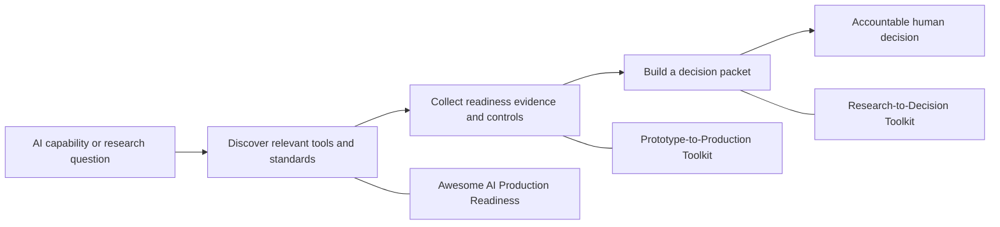

# Anonymousyz

I build practical tools for a narrow but consequential question:

> A demo works. What evidence is needed before it changes a real workflow?

The public work here focuses on AI deployment, AI governance, and evidence-backed decision design. The common thread is straightforward: translate an AI capability into a workflow, define the data boundary, test the output, assign control and ownership, then leave the final decision with accountable people.

## Start here

| If you need to... | Repository | What you can inspect |
|---|---|---|
| Decide whether an AI prototype has enough evidence for a controlled pilot | [AI Prototype-to-Production Toolkit](https://github.com/Anonymousyz/ai-prototype-to-production-toolkit) | Fixed 70-point CLI, eight veto conditions, JSON schema, fictional cases, reports, and unit tests |
| Find tools for evaluation, observability, guardrails, governance, and deployment | [Awesome AI Production Readiness](https://github.com/Anonymousyz/awesome-ai-production-readiness) | Curated 57-resource catalog, duplicate checks, archived-resource handling, link checker, and curation policy |
| Turn research into a packet for a human decision meeting | [Research-to-Decision Toolkit](https://github.com/Anonymousyz/research-to-decision-toolkit) | Fixed 24-point structural check, decision-review module, fictional decision packet, CLI, and tests |



## What the repositories demonstrate

The code and documentation make several claims that are easy to check:

- **Workflow framing:** templates turn vague deployment ideas into explicit questions about owners, data, users, failure conditions, and rollback.
- **Evaluation discipline:** the flagship CLI rejects custom denominators, missing dimensions, incomplete veto declarations, absent evidence, and malformed review metadata.
- **Governance in delivery:** NIST and OWASP mappings, risk registers, system cards, and decision packets sit next to implementation artifacts rather than after them.
- **Decision quality:** alternatives, criteria, stakeholders, reversibility, trade-offs, and pre-mortem failure are visible in the R2D packet.
- **Engineering hygiene:** local tests, schemas, generated reports, complete licenses, changelogs, explicit security boundaries, and reproducible commands are part of each repository.

## How to review the work

Start with a README, then run a local command. The repositories have no model API-key dependency and the public examples are fictional.

```bash
# Example: run the flagship tool locally
python -m pip install -e .
ai-ready score examples/sample_assessment.json
python -m unittest discover -s tests -v
```

Each README states what its CLI checks and what it cannot establish. A passing score is never described as production approval, source authentication, compliance certification, or a substitute for accountable review.

## Boundaries

- Public examples are fictional, synthetic, or built from public sources.
- The repositories deliberately omit client, employer, personal, and confidential operating information.
- A schema check proves that declared fields are present. It does not prove that an underlying source is true or that a named reviewer is independent.
- The public portfolio is a set of methods and working artifacts, not a claim of deployed-client outcomes.

The GitHub handle is pseudonymous. That choice keeps public methods separate from employer and client information while preserving material that technical and governance reviewers can inspect directly.

## Current focus

- AI deployment workflows in regulated and high-consequence settings
- Evaluation, rollback, human review, auditability, and operating ownership
- AI governance translated into product, engineering, and decision artifacts
- Research-to-decision methods for policy, consulting, and applied AI work

MIT or CC0 licensing applies to the linked repositories as stated in each project.